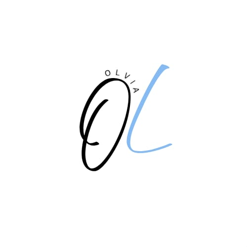

<div align="center">
  

  # Olvia

  **A caregiver-connected medication assistant for the Ol smart bottle.**

  Personalised reminders, sensor-confirmed adherence tracking, and automatic
  pill dispensing — built for elderly and neurodivergent users who find
  standard pillboxes and phone alarms unusable.

  <sub>Built for STRIDE Makeathon 2025 · IEEE Kerala Section · K-DISC</sub>
</div>

---

## The problem

India has over 8 million children with developmental disabilities and millions
of elderly people with cognitive or motor impairment. Standard water bottles,
separate pillboxes, and phone alarms fail them: bottles are too heavy to lift,
pill timings are confusing, and jarring alarms cause sensory aversion.

Olvia combines hydration, pill organisation, and sensory-friendly reminders in
one device — co-created with users at BUDS schools and eldercare homes in
Kerala.

## Try it without hardware

**The whole system runs in your browser.** A virtual bottle implements the same
BLE protocol as the firmware, so you can exercise dispensing, sensors, offline
sync, and failure handling with no ESP32 on your desk.

```bash
npm install
cp .env.example .env      # add your Firebase web config
npm run dev
```

Then open the **Bottle** page and click **"Connect simulated bottle"**.

From the simulator panel you can:

- take a pill from any compartment — fires the sensor events that confirm intake
- force failures: jam, empty compartment, servo timeout, lid open
- drain the battery, open the lid, drop the connection
- advance the bottle's clock to reach a scheduled dose immediately

Two flows worth trying, because they are the hard ones to test on real hardware:

| Flow | How |
|---|---|
| **Offline queue** | Drop the connection, take a pill, reconnect. The event is recorded on the bottle, replayed on sync, and lands in the database. |
| **Auto-dispense** | Create a schedule with auto-dispense enabled, push it to the bottle, then advance the clock. The bottle fires the reminder and dispenses on its own. |

The simulator speaks the real 20-byte frames and connects through the same
session path as hardware, so the protocol encoding, event parsing, ack
handling, and reconnect logic are all genuinely exercised.

## Features

- **Medication and schedule management** — times, days, compartments, and the
  BB/AB/BL/AL/BD/AD meal labels users already recognise
- **Sensor-confirmed adherence** — a dose counts as taken when the compartment
  sensor sees the pill leave, not when the clock passes
- **Multi-modal reminders** — LED, buzzer, vibration, and recorded voice, so
  the prompt can be tuned to what a given user tolerates
- **Caregiver voice prompts** — a familiar voice measurably improves compliance
- **Adherence reports** — daily and per-medication breakdowns with a dose log
- **Accessibility controls** — font size, high contrast, dyslexia-friendly
  fonts, text spacing, line height, and a larger cursor
- **Offline-tolerant sync** — the bottle holds its own schedule and event
  queue, so reminders fire and intakes record with no phone present

## Architecture

```
src/
├── app/                    Next.js App Router pages
│   ├── page.tsx            Dashboard — today's doses, adherence, bottle status
│   ├── medications/        Medication CRUD
│   ├── schedule/           Schedule builder (times, days, reminders, dispensing)
│   ├── voice/              Voice prompt recording
│   ├── led/                Per-schedule LED display settings
│   ├── bottle/             Pairing, schedule sync, hardware tests, simulator
│   ├── reports/            Adherence over time
│   ├── settings/           Profile and accessibility defaults
│   └── help/               FAQs and safety guidance
├── components/
│   ├── BottleSimulator.tsx Virtual bottle control panel
│   ├── AuthGuard.tsx       Route protection
│   └── layout/             Dashboard chrome, navigation, accessibility panel
├── context/
│   ├── AuthContext.tsx     Session state
│   └── AppContext.tsx      Data subscriptions, dose computation, bottle events
├── services/
│   ├── ble.ts              BLE protocol v1 client
│   ├── bleSimulator.ts     Virtual bottle (same protocol, no hardware)
│   ├── firestore.ts        Data layer — CRUD and realtime subscriptions
│   ├── firebase.ts         Auth
│   └── voiceRecording.ts   Microphone capture
└── types/                  Shared domain types

firmware/
├── PROTOCOL.md             BLE service, characteristics, frame layouts
└── olvia_esp32/            ESP32 sketch — servos, sensors, event queue
```

**Stack:** Next.js 14 · TypeScript · Tailwind CSS · Firebase (Auth + Firestore)
· Web Bluetooth · ESP32

### Design notes

**Doses are computed, not stored.** Schedules expand into concrete dose slots on
read and are folded against recorded intakes. A slot with no record is pending
until it is an hour late, then counts as missed. This keeps a schedule edit from
rewriting history.

**Intakes are idempotent.** Each record is keyed by user, schedule, and slot
time, so a replayed bottle event or a double tap updates one document instead of
inflating adherence.

**Events are acked after persistence.** The bottle holds an event until the app
confirms it was stored, so a failed write replays rather than silently dropping
a dose.

## Setup

See **[SETUP.md](SETUP.md)** for Firebase configuration, security rules
deployment, firmware flashing, and pairing.

Short version:

1. Enable Authentication and Firestore in the Firebase console
2. `firebase deploy --only firestore:rules,firestore:indexes`
3. `npm run dev`

Firebase Storage is deliberately unused — it requires a paid plan. Voice
recordings are stored inline in Firestore, keeping the project on the free tier.

## Hardware

The current prototype is 3D-printed with a six-compartment pill column, a
650 ml water chamber, a flexible steel straw, and ergonomic side grips.

The IoT build targets an **ESP32** (the original Arduino Nano has no radio),
with a micro servo and IR break-beam sensor per compartment, plus a lid switch,
LED, buzzer, and vibration motor. Pin assignments are declared at the top of the
sketch.

> The firmware compiles but has not yet been verified on physical hardware.
> Treat it as a working draft.

## Status

**Working:** authentication, medication and schedule management, dose tracking,
adherence reports, voice prompts, accessibility controls, BLE protocol client,
bottle simulator, security rules.

**Not yet built:**

- Push notifications (FCM) — in-app notifications only, so alerts need the app open
- Server-side missed-dose watcher — doses show as missed in the UI, but nothing
  reaches a caregiver while the app is closed
- Caregiver linking UI — the data model and rules support it, the screen does not exist

**Platform limits:** Web Bluetooth requires Chrome, Edge, or Opera on desktop or
Android. Safari and iOS are not supported.

## Safety

Olvia supports a medication routine — it does not replace medical advice.

Automatic dispensing releases medication unattended and is **off by default**.
Before enabling it with a real person, bench-test every failure path with dummy
pills: jam, empty compartment, lid open, and the repeat-dispense cooldown. The
device cannot verify who takes a dispensed pill.

## Team

Team Olvia — Brigit Thomas (lead), Asil Muhammed Naseer, Jeevan Martin,
Vismaya V Menon, Aarwin Augustin, Madhavi Krishna P S

Faculty mentor: Mr. Anil Antony · STRIDE mentor: Ms. Anjali Prasad

## License

[MIT](LICENSE)
